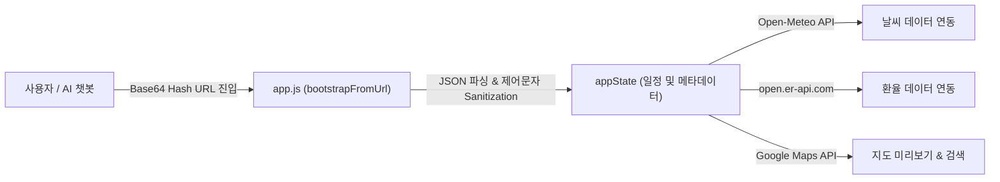

# 📘 Tour City Planner - 시스템 아키텍처 및 상세 개발자 매뉴얼

본 문서는 **Tour City Planner** 서비스의 내부 구조, 데이터 프로토콜, AI 프롬프트 연동 방식 및 개발자용 확장 방법을 다루는 서브 상세 설명서입니다.

---

## 🏗️ 1. 시스템 아키텍처 및 핵심 데이터 프로토콜

Tour City Planner는 백엔드 서버 없이 동작하는 100% Client-Side 정적 웹 애플리케이션입니다. 모든 여행 일정 상태는 브라우저 URL의 **Base64 Hash (`#plan=...`)**에 인코딩되어 전달됩니다.



### 🔐 Base64 URL 인코딩/디코딩 규격 (`#plan=...`)

일정 데이터는 네트워크 전송과 URL 공유를 위해 UTF-8 바이트 배열을 Base64(URL Safe)로 변환합니다.

#### 인코딩 구조 (JSON)
```json
{
  "v": 3,
  "g": [
    {
      "d": "tokyo",
      "s": "2026-08-16",
      "e": "2026-08-16"
    }
  ],
  "i": [
    {
      "a": [
        {
          "d": "tokyo",
          "h": "09:00",
          "l": "Tokyo Disneyland 입장",
          "k": "ticket",
          "m": "디즈니랜드 당일치기 시작"
        }
      ]
    }
  ]
}
```

* **`v`**: 프로토콜 버전 (현재 Version 3)
* **`g`**: 목적지 세그먼트 배열 (`d`: 도시ID, `s`: 시작일, `e`: 종료일)
* **`i`**: 일차별 활동 배열 (`a`: 활동 항목 배열)
  * `d`: 도시 식별자
  * `h`: 시각 (`HH:mm`)
  * `l`: 활동명 (Location/Title)
  * `k`: 아이콘 키 (`plane`, `ticket`, `utensils`, `hotel`, `shopping-bag` 등)
  * `m`: 메모 (Memo)

> [!NOTE]
> **LLM 제어문자 자동 소독 (Sanitization)**:
> 챗봇(ChatGPT, Claude 등)이 생성한 Base64 데이터를 디코딩할 때 JSON 개행이나 제어 문자로 인해 `SyntaxError`가 발생하는 것을 방지하기 위해, `decodePlan()` 함수 내에서 문자열 값을 자동으로 Sanitization 처리합니다.

---

## 🤖 2. AI 챗봇 연동 및 동적 프롬프트 매커니즘

앱 상단의 **"AI에게 일정 짜달라고 하기"** 기능은 사용자가 선택한 도시와 날짜를 기반으로 챗봇 전용 지시문(Prompt)을 자동 구성해 클립보드에 복사해 줍니다.

### 프롬프트 작동 수칙
1. AI가 복잡한 부연 설명이나 질문을 덧붙이지 않고 **즉시 1초 만에 `#plan=...` 형태의 완벽한 URL 하나만 반환**하도록 엄격한 지시문 포함.
2. 사용자가 요구사항을 텍스트로 추가하더라도 최단 시간 내 결합된 URL을 생성하도록 설계.

---

## 🛠️ 3. 개발자 확장 가이드 (신규 도시 및 아이콘 추가)

### ① 신규 도시 템플릿 추가 (`app.js`)
`app.js` 파일 상단의 `DESTINATIONS` 객체에 새로운 도시 ID와 기본 템플릿 일정을 추가합니다.

```javascript
const DESTINATIONS = {
  "seoul": {
    "city": "Seoul",
    "cityKo": "서울",
    "countryKo": "대한민국",
    "currency": "KRW",
    "lat": 37.5665,
    "lng": 126.9780,
    "defaultDays": 2,
    "itinerary": [
      [
        { "time": "10:00", "label": "경복궁 관람", "icon": "landmark", "memo": "한복 착용 시 무료 입장" },
        { "time": "13:00", "label": "인사동 점심 식사", "icon": "utensils", "memo": "전통 찻집 방문" }
      ]
    ]
  }
};
```

### ② 활동 아이콘 확장
`ACTIVITY_ICON_OPTIONS` 배열에 Lucide 아이콘 명칭을 등록하여 UI 픽커에 노출할 수 있습니다.

---

## 📄 4. 라이선스 및 상업적 연동 지침

본 프로젝트는 **CC BY-NC 4.0 (비영리)** 라이선스로 배포됩니다.
* **비영리/개인 사용**: 자유롭게 수정, 공유 및 활용 가능.
* **상업적 사용 (기업 서비스 탑재, 유료 연동, 대행업 등)**: 저작권자(`contact@ai-ing.org`)와 상업 라이선스 계약 필수.
