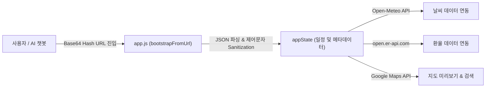

# 📘 Tour City Planner - 시스템 아키텍처 및 상세 개발자 매뉴얼

본 문서는 **Tour City Planner** 서비스의 내부 구조, 데이터 프로토콜, AI 프롬프트 연동 방식 및 개발자용 확장 방법을 다루는 서브 상세 설명서입니다.

---

## 🏗️ 1. 시스템 아키텍처 및 핵심 데이터 프로토콜

Tour City Planner는 백엔드 서버 없이 동작하는 100% Client-Side 정적 웹 애플리케이션입니다. 모든 여행 일정 상태는 브라우저 URL의 **Base64 Hash (`#plan=...`)**에 인코딩되어 전달됩니다.


```mermaid
graph LR
    User["사용자 / AI 챗봇"] -->|Base64 Hash URL 진입| App["app.js (bootstrapFromUrl)"]
    App -->|JSON 파싱 & 제어문자 Sanitization| State["appState (일정 및 메타데이터)"]
    State -->|Open-Meteo API| Weather["날씨 데이터 연동"]
    State -->|open.er-api.com| Currency["환율 데이터 연동"]
    State -->|Google Maps API| Maps["지도 미리보기 & 검색"]
```

### 🔐 Base64 URL 인코딩/디코딩 규격 (`#plan=...`)

일정 데이터는 네트워크 전송과 URL 공유를 위해 UTF-8 바이트 배열을 Base64(URL Safe)로 변환합니다.

#### 인코딩 구조 (JSON)
```json
{
  "v": 3,
  "g": [
    {
      "d": "tokyo",
      "s": "2026-08-16",
      "e": "2026-08-16"
    }
  ],
  "i": [
    {
      "a": [
        {
          "d": "tokyo",
          "h": "09:00",
          "l": "Tokyo Disneyland 입장",
          "k": "ticket",
          "m": "디즈니랜드 당일치기 시작"
        }
      ]
    }
  ]
}
```

* **`v`**: 프로토콜 버전 (현재 Version 3)
* **`g`**: 목적지 세그먼트 배열 (`d`: 도시ID, `s`: 시작일, `e`: 종료일)
* **`i`**: 일차별 활동 배열 (`a`: 활동 항목 배열)
  * `d`: 도시 식별자
  * `h`: 시각 (`HH:mm`)
  * `l`: 활동명 (Location/Title)
  * `k`: 아이콘 키 (`plane`, `ticket`, `utensils`, `hotel`, `shopping-bag` 등)
  * `m`: 메모 (Memo)

> [!NOTE]
> **LLM 제어문자 자동 소독 (Sanitization)**:
> 챗봇(ChatGPT, Claude 등)이 생성한 Base64 데이터를 디코딩할 때 JSON 개행이나 제어 문자로 인해 `SyntaxError`가 발생하는 것을 방지하기 위해, `decodePlan()` 함수 내에서 문자열 값을 자동으로 Sanitization 처리합니다.

---

## 🤖 2. AI 챗봇 연동 및 동적 프롬프트 매커니즘

앱 상단의 **"AI에게 일정 짜달라고 하기"** 기능은 사용자가 선택한 도시와 날짜를 기반으로 챗봇 전용 지시문(Prompt)을 자동 구성해 클립보드에 복사해 줍니다.

### 프롬프트 작동 수칙
1. AI가 복잡한 부연 설명이나 질문을 덧붙이지 않고 **즉시 1초 만에 `#plan=...` 형태의 완벽한 URL 하나만 반환**하도록 엄격한 지시문 포함.
2. 사용자가 요구사항을 텍스트로 추가하더라도 최단 시간 내 결합된 URL을 생성하도록 설계.

---

## 🛠️ 3. 개발자 확장 가이드 (신규 도시 및 아이콘 추가)

### ① 신규 도시 템플릿 추가 (`app.js`)
`app.js` 파일 상단의 `DESTINATIONS` 객체에 새로운 도시 ID와 기본 템플릿 일정을 추가합니다.

```javascript
const DESTINATIONS = {
  "seoul": {
    "city": "Seoul",
    "cityKo": "서울",
    "countryKo": "대한민국",
    "currency": "KRW",
    "lat": 37.5665,
    "lng": 126.9780,
    "defaultDays": 2,
    "itinerary": [
      [
        { "time": "10:00", "label": "경복궁 관람", "icon": "landmark", "memo": "한복 착용 시 무료 입장" },
        { "time": "13:00", "label": "인사동 점심 식사", "icon": "utensils", "memo": "전통 찻집 방문" }
      ]
    ]
  }
};
```

### ② 활동 아이콘 확장
`ACTIVITY_ICON_OPTIONS` 배열에 Lucide 아이콘 명칭을 등록하여 UI 픽커에 노출할 수 있습니다.

---

## 📄 4. 라이선스 및 상업적 연동 지침

본 프로젝트는 **CC BY-NC 4.0 (비영리)** 라이선스로 배포됩니다.
* **비영리/개인 사용**: 자유롭게 수정, 공유 및 활용 가능.
* **상업적 사용 (기업 서비스 탑재, 유료 연동, 대행업 등)**: 저작권자(`contact@ai-ing.org`)와 상업 라이선스 계약 필수.

## 일정 그래프 (v4)

- `graph-model.js`는 날짜별 순서가 있는 DAG를 관리한다. 한 행은 최대 3개 노드다.
- 카드를 다른 카드의 왼쪽/오른쪽 가장자리로 끌면 같은 행에 나란히 놓인다. 드롭 대상이 강조되며 최대 3개까지만 허용한다. 위아래로 끌면 독립 행으로 분리된다. 새 카드는 날짜의 `+ 일정`으로 만든다.
- 카드 아래 연결점을 뒤쪽 카드 위 연결점으로 끌어 연결한다. 여러 선을 같은 카드에 연결하면 합류한다. 키보드는 출발점 Enter → 도착점 Enter이며 Escape는 취소한다. 선 중앙의 ×는 선만 제거하고 카드의 ×는 노드를 제거해 앞뒤 연결을 이어준다.
- 순서 이동은 카드 본문에서 가능하다. 터치에서는 300ms 길게 누르며, 빠른 스와이프는 기존 스크롤이다. 키보드 Alt+↑/↓도 유지한다.
- 공유 데이터 `v:4`의 `a[].id`, `a[].r`는 노드/행 ID, 날짜 `e`는 `[from,to]` 연결 배열이다. 제목 `n`과 지도 검색 `q`도 보존한다. v3 이하의 링크는 기존 순서를 따라 연결하며, 명시적인 빈 날짜와 끊어진 연결도 유지한다.
- 그래프 분기에는 단일 ‘하루 이동코스’를 제공하지 않는다. 실제 연결선을 누르면 해당 구간의 길찾기 미리보기가 열린다.
- `example-hotels.js`의 호텔은 예시 일정의 장소명이다. 실제 예약/가격/공실 정보가 아니다. AI 생성 프롬프트에도 구체적인 호텔명을 요청한다.
- 같은 시간대의 추가 도시 안내는 `EXTRA_CITY_LABELS`에 있다. 안내용 도시명을 완성된 일정 템플릿으로 취급하지 않는다.
- 모델 회귀 검사: `node scripts/test-graph.cjs`.

호텔명 참고: [Hilton Tokyo](https://www.hilton.com/en/hotels/tyohitw-hilton-tokyo/), [Pullman Paris Tour Eiffel](https://all.accor.com/hotel/7229/index.en.shtml), [The Palace Madrid](https://www.marriott.com/en-us/hotels/madcl-the-palace-a-luxury-collection-hotel-madrid/overview/), [Phoenix Seagaia Ocean Tower](https://en.seagaia.co.jp/), [Arusha Serena](https://www.serenahotels.com/arusha).

## 블록 중심 편집

- 장소를 누른 뒤 ‘어디 다음에 갈까요?’에서 선행 장소를 선택하면 배치와 선을 자동 구성한다. 여러 개 선택하면 합류한다. 후속 장소는 선택 후보에서 제외하여 순환을 막는다.
- 시간은 선택이다. 공란, 오전·점심·오후·저녁·밤, 정확한 시각을 저장할 수 있으며 이동으로 덮어쓰지 않는다. 대략적 시간대의 날씨는 각각 09·12·15·18·21시 예보를 사용한다. 미정은 시간별 예보를 표시하지 않는다.
- 편집창은 장소·시간·선행 장소만 먼저 보이고 지도·메모·아이콘은 접혀 있다.

## 자리 선택으로 추가

- `+ 일정`을 누르면 반투명 새 블록과 앞·뒤·옆의 배치 자리가 나타난다. 포인터로 미리 보고 클릭하거나 모바일에서 자리를 탭한다. 취소/Escape는 변경 없이 끝난다.
- 선택한 위치에 붙은 편집 팝업에서 장소를 저장하면 블록을 삽입한다. 배경 dim과 페이지 스크롤 잠금은 없다.
- 시간은 네이티브 시간 선택기와 ‘미정 · 순서만’ 버튼을 사용한다. 지도는 기본으로 펼친다. 선행 장소 선택 UI는 숨기고 배치 위치로 연결한다.
